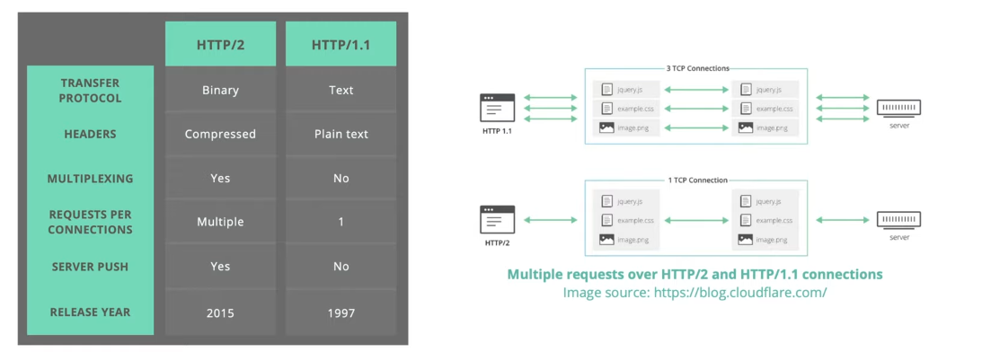
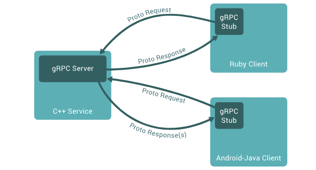
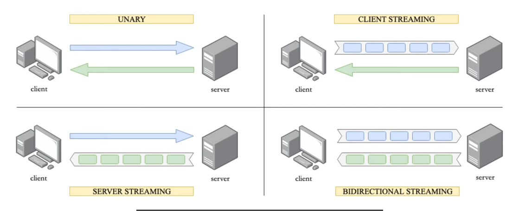
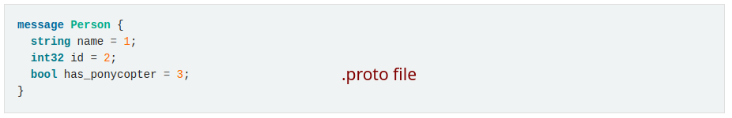
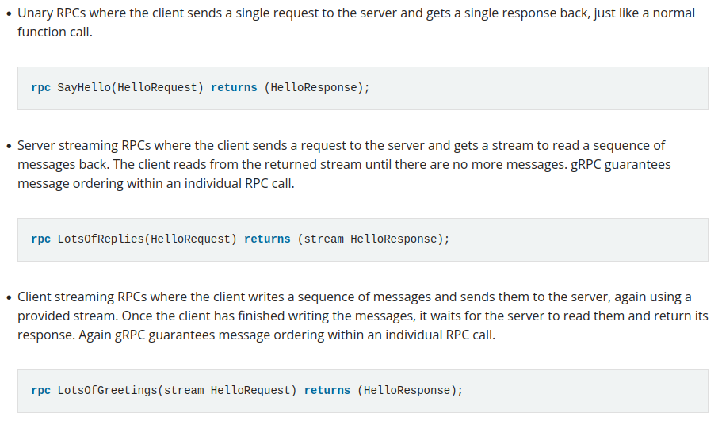
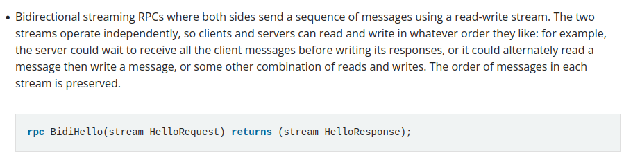
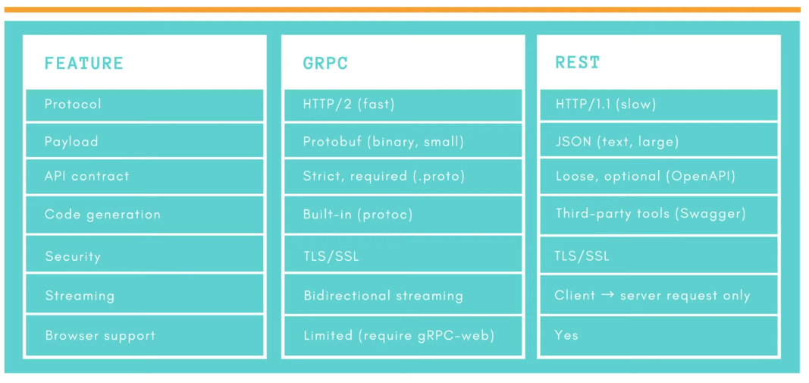
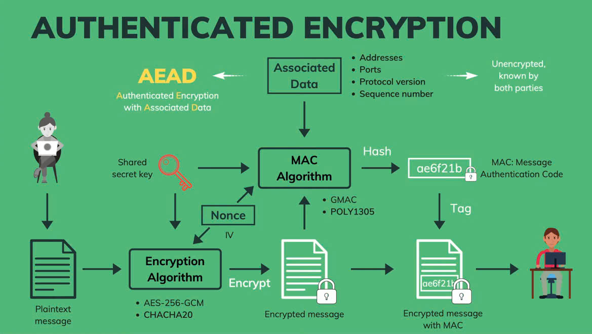
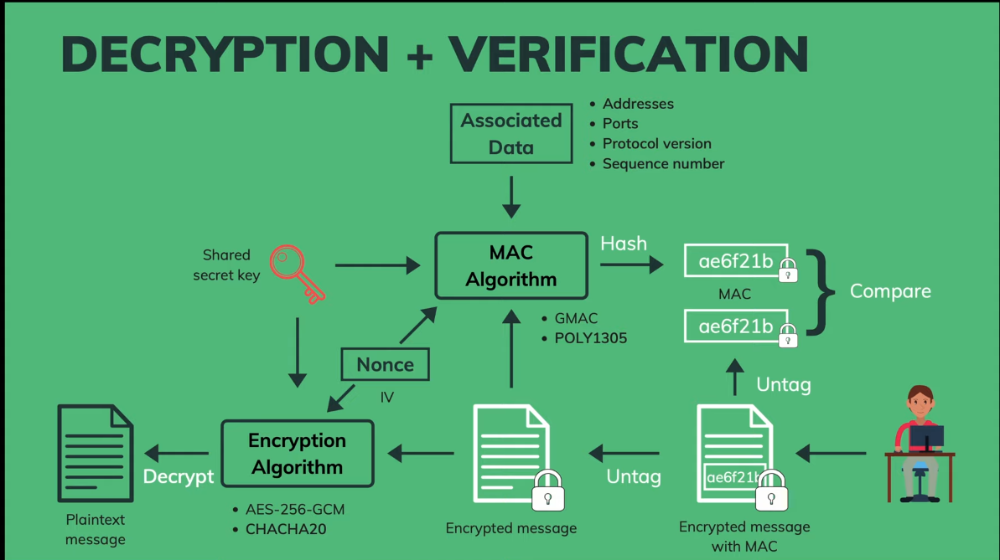
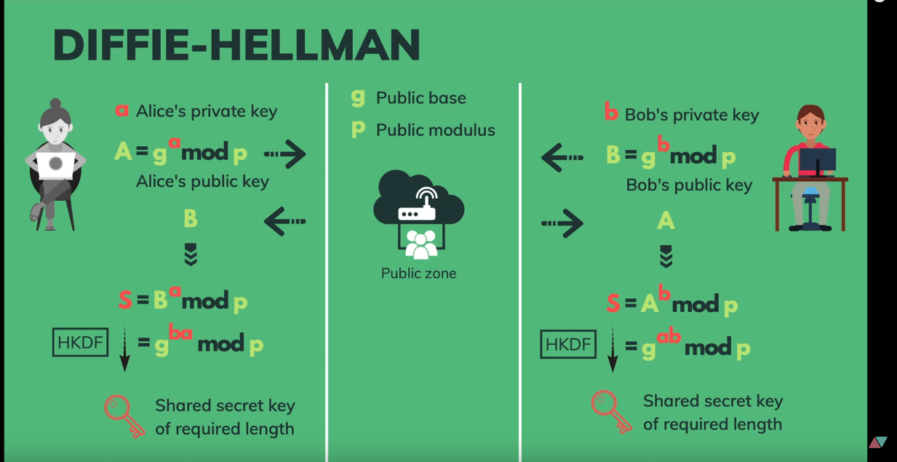

## DIFFERENCE HTTP/1.1 AND HTTP/2



## gRPC

- gRPC - Remote Procedure Call is framework to build RPC service with high performence and high effective, use HTTP/2 protocol for transfer data and Protocol Buffers (protobuf) to serialize data.
- `g` in `gRPC` have not true mean, it could be `Google`, could be `general-purpose` and could be `generic` to emphasize `gRPC` is a framework to serve multiple purposes, run in cross platforms and support multi-language.
- Use `HTTP/2` to transfer data.

### OVERVIEW

- In gRPC, a client application can directly call a method on a server application on a different machine as if it were a local object, making it easier for you to create distributed applications and services. As in RPC system, rRPC is based around the idea of defining a service, specifying methods that can be called remotely with their parameters and return types. On the server side, the server implements this interface and run a gRPC server to handle client calls. On the client side, the client has a stub (referred to as just a client in some languages) that provides the same methods as the server.
  
- gRPC clients and servers can run and talk to each other in a variety of environments - from servers inside Google to your own desktop - and can be written in any of gRPC’s supported languages. So, for example, you can easily create a gRPC server in Java with clients in Go, Python, or Ruby. In addition, the latest Google APIs will have gRPC versions of their interfaces, letting you easily build Google functionality into your applications.

### Types of gRPC



### WORKING WITH PROTOCOL BUFFERS

- Protocol Buffers are a language-neutral extensible mechanism for serializing structured data. [Docs ProtoBuf]('https://protobuf.dev/overview/')
- It’s like JSON, except it’s smaller and faster, and it generates native language bindings. You define how you want your data to be structured once, then you can use special generated source code to easily write and read your structured data to and from a variety of data streams and using a variety of languages. Protocol buffers are a combination of the definition language (created in .proto files), the code that the proto compiler generates to interface with data, language-specific runtime libraries, the serialization format for data that is written to a file (or sent across a network connection), and the serialized data
- By default, `gRPC` uses Protocol Buffers, Google’s mature open source mechanism for serializing structured data (although it can be used with other data formats such as JSON)

### CORE CONCEPTS



- `gRPC` lets you define four kinds of service method:
  
  

### gRPC AND REST



### DEFINE A PROTOCOL MESSAGE


## USE PROTOC

- Install binary package `protobuf` in [github](https://github.com/protocolbuffers/protobuf/releases)
- Install via package management:
  - ArchLinux:

```bash
sudo pacman -S protobuf
```

- Ubuntu:

```bash
sudo apt install protobuf
```

- Install protobuf gen go:

```bash
go install google.golang.org/protobuf/cmd/protoc-gen-go@latest
go install google.golang.org/grpc/cmd/protoc-gen-go-grpc@latest
```

### Step

- 1. Create `.proto` file to define protobuf. File look like this:

```protobuf
syntax = "proto3";

package gRPC.core;

option go_package = "/protoc_gen";

import "memory_message.proto";

message CPU {
    string brand = 1;
    string name = 2;
    uint32 number_cores = 3;
    uint32 number_threads = 4;
    double min_ghz = 5;
    double max_ghz = 6;
}

message GPU {
    string brand = 1;
    string name = 2;
    double min_ghz = 3;
    double max_ghz = 4;
    Memory memory = 5;
}
```

- `syntax`: define syntax `.proto` file
- `;` is require in last line.
- `package`: define import type support java-lang
- `option`: define language use package. In here is for Golang. The value is package will use for generate code gRPC golang.
- `message`: define protobuf message, the type variable name is CamelCase.

  - Define field and datatype, value is `number` or `iota`, not equal in one message.

- Run the compiler, you would invoke:

```bash
protoc -I=proto --go_out=./ proto/*.proto
```

### REGENERATE gRPC

- Change current directory in folder contains proto file (in this is `proto` folder).

```bash
protoc --go_out=../protoc_gen/ --go_opt=paths=source_relative --go-grpc_out=../protoc_gen/ --go-grpc_opt=paths=source_relative ./*.proto
```

or run `make` when you in source relative:

```
make protoc-service
```

### gRPC INTERCEPTOR

- It is `Middleware funtion` serve:
  - Logging, tracing, rate-limiting
  - Authentication, Authorization
- Todo:
  - Implement server interceptor (Authenticate user with JWT, Authorize access by roles).
  - Implement client interceptor (Login user to receive access token, attach token to RPC requests).

### TYPES OF gRPC CONNECTION

- gRPC have three connection types:

1. Insecure: transfer plaintext data ,no encryption.
2. Server side TLS: encrypted data, only server needs to provide its certificate to client. Use for any application call it, not care what app call it.
3. Mutual TLS: Encrypted data, both server and client need to provide certificates to each other. Use for management and control app call to server.

## SSL/TLS

### Introduce

- SSL: Socket Secure Layer - the predecessor of TLS.
  - History:
    - 1995: Netscape release version 2.0 (Not have version 1.0)
    - 1996: version 3.0 and completely different protocol.
    - Version 2.0 is deprecated in 2011, version 3.0 in 2015.
- TLS: Transport Layer Security - A cryptographic protocol that provides secure communication over a computer network.
  - History:
    - 1999: IETF release version 1.0. It is upgrade SSL version 3.0
    - 2006: release version 1.1.
    - 2008: release version 1.2.
    - 2018: release version 1.3.
    - version 1.0, 1.1 in 2020 is deprecated.

### How it Work

- TLS have 2 phase or 2 protocol.
- The first is `Handshake Protocol`:
  - Client and server negotiate TLS protocol version -> select cryptographic algorithms: cipher suites -> Authenticate by asymmetric cryptography -> Establish a secret key for symmetric encryption.
  - Purpose of `handshake`: Authenticate and exchange key.
- The second is `Record protocol`:
  - Out going message will be encrypt with the secret key
  - Transmit the encrypted message
  - Decrypt incoming message by secret key.
  - Verify that the message are not modified.

### Why TLS use both symmetric key and asymmetric key

- Symmetric cryptography cannot be use for authentication, key sharing is hard.
- asymmetric cryptography is much slowly (100 -> 10000), that reason it not suitable bulk encryption.
- Symmetric cryptography:
  - One key to encrypt and decrypt.
  - Hacker can implements `bit-flipping attacks` to change message encrypted.
  - Can use Authenticated encryption: encrypt message by key, add `nonce` or `vector IV` init input -> encrypt message. From shared key and `Nonce`, use MAC algorithms - like hash function and output is key MAC - Message Authentication Code. It attach to message encrypted and finish send to user.
    
  - Decryption and verify: untag MAC -> use MAC algorithms to hash data -> compare hash.
    
  - Ky exchange: How to exchange key without leaking them?
    
- Asymmetric cryptography:
  - Can use Diffie Hellman Ephemeral (DHE)
  - Message from user sent will be encrypt by public key of user receive. Message encrypted will be decrypt by secret key.
  - Although public key and secret key is different, but it is a pair, encrypt message by one key and decrypt by one other key. But hacker can change public key of user receive data by public key of hacker. When that user send message, hacker can decrypt that message (can use two-way)
  - Must be `digital certificate` have identifier. User receive data have public key on certificate - like passport in real live (must be verify and sign by `Certificate Authority`).

### How to use generate Go code

- Write messages into `.proto` file into folder `proto`.

```protobuf
syntax = "proto3";

option go_package = "/protoc";

message CPU {
  string brand = 1;
  string name = 2;
  uint32 num_cores = 3;
  uint32 num_threads = 4;
  double min_ghz = 5;
  double max_ghz = 6;
}
```

- Install package `protoc-gen-go-grpc` and `protoc-gen-go`

```bash
go install google.golang.org/grpc/cmd/protoc-gen-go-grpc@latest
go install google.golang.org/protobuf/cmd/protoc-gen-go@latest
```

- Run command to generate code:

```bash
# --go_out: generate code for gRPC service into package defined in option go_package
protoc --proto_path=proto  --go_out=. --go_opt=paths=import  --go-grpc_out=. --go-grpc_opt=paths=import proto/*.proto
```

or

```bash
make gen-protobuf
```
